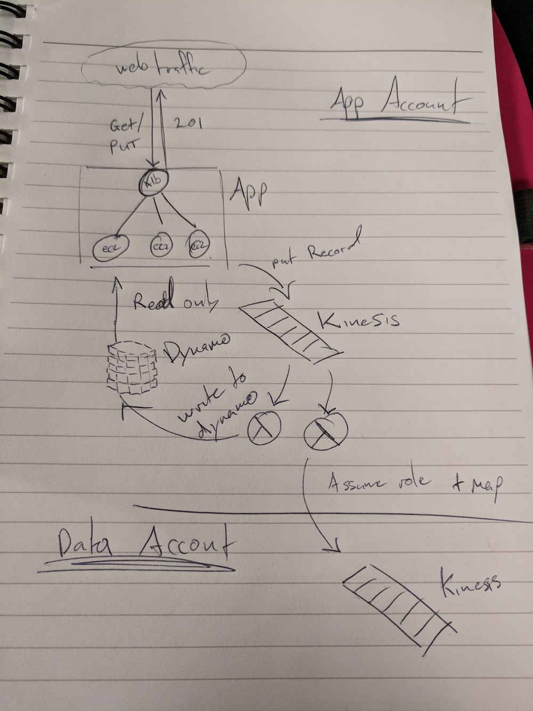

# A spike - Handling events cross-account in AWS

This is a short spike for a relatively simple problem, but one I wanted to
prove-out to ensure it was possible.

## Context

Given a standard restful microservice in AWS serving web-traffic from dynamodb where the data is:

- of relatively high value 
- likely to be used for a combination of reporting and operational purposes
- *Probably* can be made idempotently
- Where eventual consistency is acceptable

How to best to architect given the objectives of:

- Data consistency in both the front-facing webservers *and* reporting
- Availability and relative responsiveness of the service
- Decoupling the producer (webservices) and consumers (data-analytics)

In particular, the problems I wanted to avoid were:

- Those coming from two-phase commit, where the application writing to the
  database and reporting system must either wait for both to complete and report
  success or partial or complete failure
- The loss in availability of the app relying on both the uptime of an
  event-reporting system *and* the database, relative to that of just relying
  on one of these.

## Spike:

### Case Studies to examine

Smarter, people with better illustration skills have done this before me, and
so I am largely just following the beaten path here:

- [JustGiving](https://aws.amazon.com/blogs/compute/serverless-cross-account-stream-replication-using-aws-lambda-amazon-dynamodb-and-amazon-kinesis-firehose/)
- [Another example](https://github.com/awslabs/kinesis-aggregation/blob/master/java/KinesisLambdaForwarder/README.md)

### First cut:

This first spike is to solve the problem by getting the webservers to write
*only* to the kinesis stream, treating it as the source of truth for incoming
data, but read *from* dynamodb. 

Lambdas can than poll Kinesis and:

1. Update dynamo records
2. Map and push data across account to the analytics engine

This has the following implications:

- Because the application is never writing to the database directly, it must
  wait on the workers to update records. Syncronous replies are no longer
  possible. Clients must poll for updates. Everything is eventually consistent.
- Writing data now cannot result on partial failure, only complete success or
  complete failure (unless one of the workers is down, in which case it is rectifiable and the data should become consistent)
- Events should be replayable, provided the events have their own id for deduplication (contrast with SQS/SNS here).

#### Cross-account foolishness: 

I'll immediately confess that cross-account permissions with AWS confuse me
more than they should, and I've still a fair bit to learn there, so take
everything here with salt, chilli and skepticism. Criticism welcome.

That said, why not simply give permissions to read directly from the central
application stream?

1. I don't believe it's possible to trigger lambda across account (citation needed)
2. I don't believe it's possible without doing an assume-role and polling,
   which is pretty ordinary, because it requires the producer to know about
   the consumer assuming a role
3. There's no isolation from breaking schema changes

The solution was to have the lambda triggering in the consumer account and then
have it push to the consuming infrastructure. This partially violates one of my
objectives of the producer/consumer knowledge relationship, but only insofar as
having to know which role to assume and which stream to write to. 

If the problem of producer/consumer knowledge is too great, this could probably be
swapped out for SNS fairly easily with most of the same benefits.

### Addenda:

#### Producing data:
- [KPL library](https://docs.aws.amazon.com/streams/latest/dev/developing-producers-with-kpl.html#developing-producers-with-kpl-role) is probably worth looking into. Looks like it could be annoying to setup and use however (c++).

